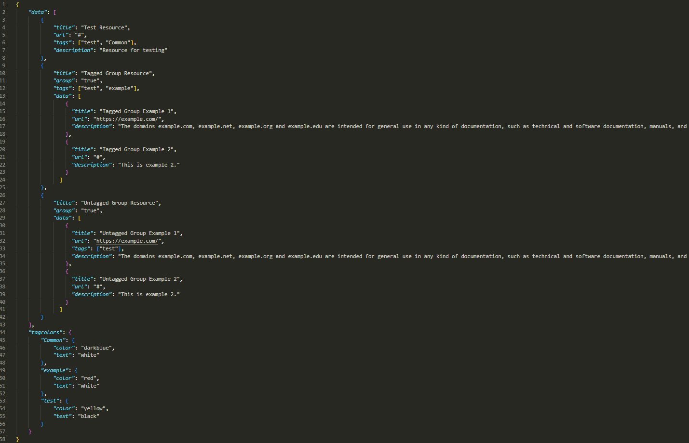
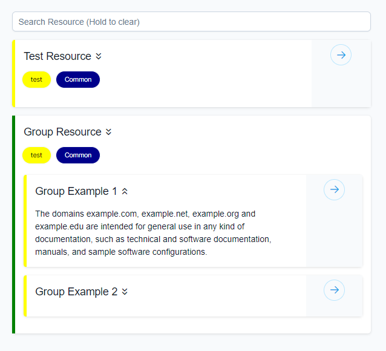

# RSHub

ReSource Hub is a VueJS application that provides searching of a resource JSON object containing the keys: title, description, tags, and url.

https://github.com/0necloud/RSHub/assets/60743000/9894a408-8667-44a4-81a5-0f10af1dea42

To link the front-end to a JSON file, I recommend using [npoint.io](https://www.npoint.io/)

### JSON File Structure:

_Note: "group" key can hold any value._

### Result:

