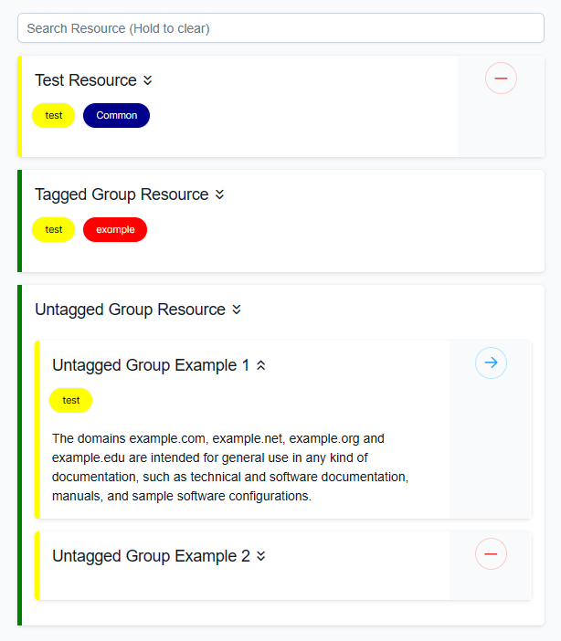

# RSHub

ReSource Hub is a VueJS application that provides searching of a resource JSON object containing the keys: title, description, tags, and url.

https://github.com/0necloud/RSHub/assets/60743000/c8c36ec5-7c47-42c2-936a-f323a18717a7

To host the JSON file, I recommend using [npoint.io](https://www.npoint.io/)

### JSON File Structure:

### Notes:
1. "group" key can hold any value.
2. Nested groups are not supported (yet)

### Preview:

